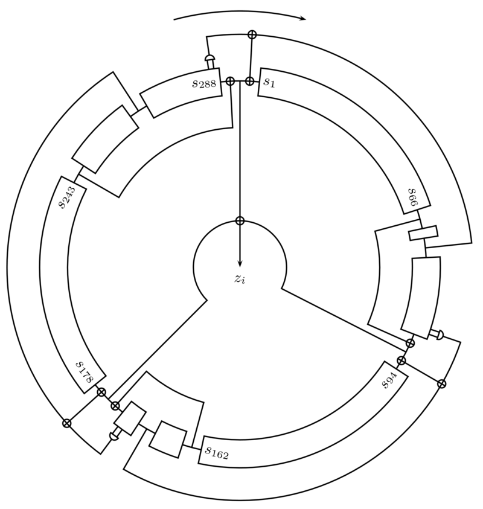
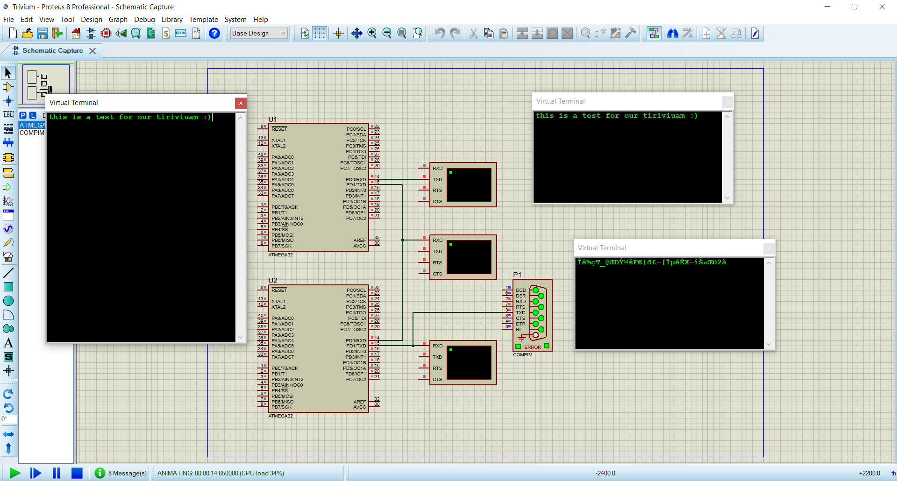

# Trivium with ATMEGA32

### Explanation
In this project, we implement **Trivium** encryption system on **ATMEGA32**. Then, we simulate it on **Proteus**, sending data to first ATMEGA32 via a **virtual-terminal** for encryption. Then we send encrypted message to another ATMEGA32 for decryption (we have a virtual-terminal in the middle to show encrypted data). Then we show plaint-text on last virtual terminal. We are going to discuss each of them, one by one.

### Trivium
Trivium is a stream cipher, i.e., encrypt data bit by bit. It use combination of 3 **LFSR** (Linear Feedback Shift Register) for generating a **CSPRNG** (Cryptography Secure Pseudo Random Number Generator) as key, and encrypt data with **XOR** operation. Your key will use in initializing the shift-registers. For decrypting data, you need the key to initialize the shift-registers and do the same.

Trivium has 3 phase:
- Initializing phase: Initialize the registers with 20 bytes
- Warm-up phase: The cipher clocked 1152 times, no output generate in this phase
- Encryption phase: The bit produce here after each clock

### Serial Port Communicating
We initialize our ATMEGA32 as a receiver and a transmitter. Reading data from a virtual-terminal, giving it to our Trivium, encrypt one byte of data, and send it out. Our character size is 8-bit, no parity bit, using 9600 Buad-rate.

### Test & Execute
As we said earlier, we simulate it on Proteus. There are 3 virtual-terminals, one for input data, one for showing encrypted data, and one for data after decrypted. Furthermore we connect the output of second ATMEGA32 to a serial port named COM100 (It’s a virtual-port and we created it using **com0com** software and you can see it’s test in video).

#### Image of program in runtime

#### Video of sending data to virutal-port and receiving using putty

P.S.: You can send the data to real-port. All you need to do is set COMPIM device virtual port to COM3 or COM4.

### Codes

- [main.c](Trivium/Trivium/main.c)
- Trivium and Encryption
    - [trivium.h](Trivium/Trivium/trivium.h)
    - [trivium.c](Trivium/Trivium/trivium.c)
- Serial port communicating
    - [uart.h](Trivium/Trivium/uart.h)
    - [uart.c](Trivium/Trivium/uart.c)

---
This was our final project in Microcontroller course.
